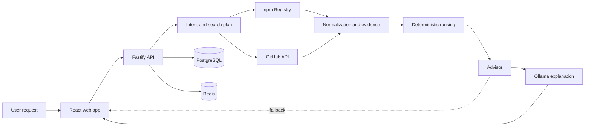

# LibAI

> Evidence-grounded open-source library discovery for JavaScript and TypeScript.

LibAI turns a natural-language software requirement into a short, explainable
comparison of open-source packages. It discovers real candidates from npm and
GitHub, collects current project signals, ranks the candidates deterministically,
and uses a local language model only to explain the verified evidence.

LibAI is designed around a simple rule: **the model may explain a recommendation,
but it may not invent one**.

## Why LibAI?

Choosing a dependency is rarely just a search problem. A useful recommendation
must account for relevance, maintenance, adoption, compatibility, project health,
and risk. LibAI brings those signals into one reproducible pipeline instead of
relying on popularity alone or on a language model's memory.

| Capability | What LibAI does |
| --- | --- |
| Intent understanding | Converts a natural-language request into a structured search plan |
| Live discovery | Searches npm Registry and the official GitHub API |
| Evidence collection | Gathers package, repository, maintenance, and compatibility signals |
| Deterministic ranking | Computes scores in application code, outside the language model |
| Grounded explanations | Uses Ollama to summarize only the evidence collected by the pipeline |
| Graceful degradation | Continues with deterministic explanations when the local model is unavailable |

## Architecture



The domain and ranking layers remain independent from transport and model
providers. External data enters through dedicated adapters, is normalized into
internal contracts, and is scored before any generated explanation is produced.

| Area | Responsibility |
| --- | --- |
| `apps/web` | React and Vite user interface |
| `apps/api` | Fastify HTTP API and operational endpoints |
| `packages/domain` | Framework-independent contracts and schemas |
| `packages/intent` | Intent parsing, constraints, query expansion, and search planning |
| `packages/github` | Safe GitHub API client and repository discovery |
| `packages/npm-registry` | npm discovery, package identity, and package signals |
| `packages/normalization` | Cross-source evidence normalization |
| `packages/ranking` | Deterministic candidate scoring |
| `packages/advisor` | Recommendation assembly and comparison |
| `packages/model` | Local model provider boundary and Ollama integration |
| `packages/application` | Application orchestration and persistence boundary |
| `packages/evaluation` | Ranking evaluation utilities and fixtures |
| `packages/resilience` | Reliability and failure-handling primitives |
| `packages/ecosystems` | Multi-ecosystem contracts and experimental support |

## Technology stack

| Layer | Technology |
| --- | --- |
| Language | TypeScript 5.9 |
| Workspace | pnpm 11 monorepo |
| Frontend | React 19, Vite 8 |
| API | Fastify 5, TypeBox |
| Data sources | npm Registry, GitHub REST API |
| Local AI | Ollama with `qwen3:4b-instruct` by default |
| Persistence | PostgreSQL 17 |
| Cache / runtime services | Redis 8 |
| Quality | Vitest, Biome, TypeScript project references |
| Deployment | Docker and Docker Compose |

## Project status

LibAI is under active development and should currently be treated as a
**pre-release project**. The end-to-end discovery, evidence, ranking, advisor,
API, web, persistence, evaluation, and local-model paths are implemented. The
remaining release gates include production environment validation, restore and
soak exercises, public-access review, and independent recommendation-quality
review.

The current product focus is JavaScript and TypeScript. Additional ecosystems
are experimental and are not yet part of the stable public scope.

## Getting started

### Prerequisites

- Node.js 24
- pnpm 11
- Git
- Ollama (recommended for generated explanations)
- A GitHub token (recommended to avoid anonymous API rate limits)

PostgreSQL and Redis are required for the containerized stack and can be started
through Docker Compose.

### Installation

```bash
git clone https://github.com/zygunay/LibAI.git
cd LibAI
pnpm install --frozen-lockfile
cp .env.example .env
```

Install the default local model:

```bash
ollama pull qwen3:4b-instruct
```

Set `GITHUB_TOKEN` in `.env` for authenticated GitHub API access. Never expose
this token through a `PUBLIC_` environment variable.

### Run locally

Start Ollama, then launch the API and web application together:

```bash
pnpm dev
```

Open [http://localhost:5173](http://localhost:5173). The API listens on
`http://localhost:3000` by default.

You can also inject a token from an authenticated GitHub CLI session:

```bash
GITHUB_TOKEN="$(gh auth token)" pnpm dev
```

If Ollama is unavailable, discovery and ranking continue to work and LibAI
returns a deterministic explanation. Without a GitHub token, results may be
partial because of anonymous API rate limits.

### Run supporting services with Docker

```bash
docker compose up --build
```

The Compose stack starts the API, PostgreSQL, and Redis. Ollama is expected to
run on the host and is reached through `host.docker.internal`.

## Development

```bash
# Build every workspace package
pnpm build

# Run the complete quality gate
pnpm check

# Run the Ollama benchmark
pnpm --filter @libai/model benchmark:ollama
```

`pnpm check` runs formatting checks, linting, type checking, tests, and the full
workspace build. Internal packages use the `workspace:*` protocol, and generated
artifacts are written to ignored `dist/` directories.

## Current scope and limitations

- Recommendations are advisory; review a dependency's source, license, security
  posture, and release history before adopting it.
- LibAI does not automatically install packages or execute third-party repository
  instructions.
- npm and GitHub availability and rate limits can affect evidence completeness.
- PyPI, Maven, and NuGet are outside the stable first-release scope.
- Local-model output is constrained by collected evidence but should still be
  treated as generated text.

## Security

Do not commit credentials. Keep `GITHUB_TOKEN` and other secrets in local
environment files or a secret manager. Only variables prefixed with `PUBLIC_`
may be bundled into the browser application, and secrets must never use that
prefix.

To run the repository's security checks:

```bash
pnpm security:check
```

Please report security-sensitive findings privately to the repository owner
instead of opening a public issue with exploit details.

## Contributing

LibAI is currently evolving quickly. Before proposing a large change, open an
issue describing the problem, intended behavior, and impact on the evidence and
ranking model. Contributions should include relevant tests and pass `pnpm check`.

## License

This project is licensed under the [MIT License](LICENSE).
